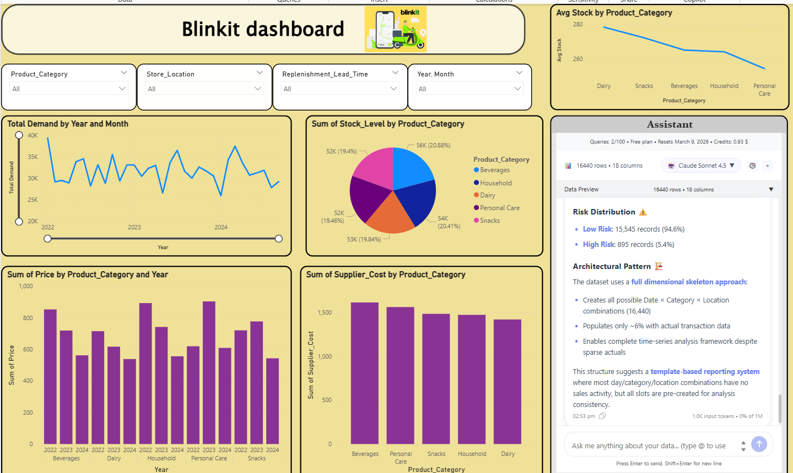

# 🛒 Blinkit Sales Dashboard (Power BI)

## 📊 Project Overview
This project is an interactive retail sales dashboard built using Power BI to analyze Blinkit's performance across different product categories and time periods.

## 🚀 Key Features
- Total Demand by Year & Month
- Stock Level by Product Category
- Supplier Cost Analysis
- Category-wise Price Trends
- Drill-down Filters (Product, Location, Lead Time)
- Interactive Slicers

## 🛠 Tools Used
- Microsoft Power BI
- DAX
- Data Modeling
- Data Visualization

## 📸 Dashboard Preview

## 📈 Business Impact
Helps in:
- Identifying high-performing categories
- Optimizing stock levels
- Understanding supplier cost variations
- Supporting data-driven decision-making
